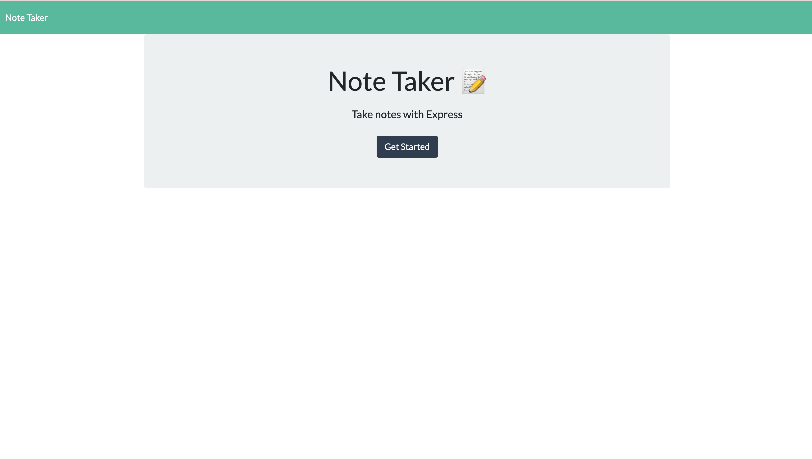
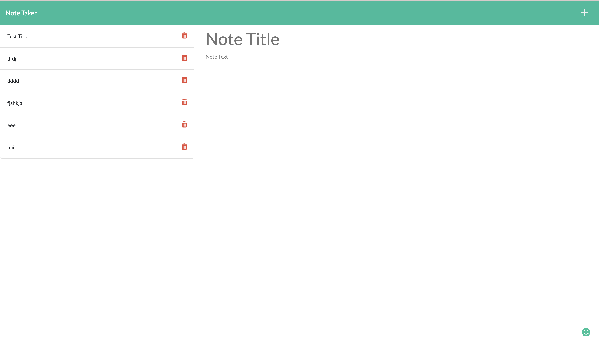

# Note-Taker-App---Express.js

## Description
Note Taker Application uses an Express.js back end and saves and retrieves note data from a JSON file, and then deploys the entire application to Heroku.

- Deployed link: https://github.com/kaihuan-huang/Work-Day-Scheduler-APP

- Heroku-page link: https://github.com/kaihuan-huang/Note-Taker-App---Express.js

## More details

- Presented with a landing page with a link to a notes page WHEN user opens the Note Taker;

- Presented with a page with existing notes listed in the left-hand column, plus empty fields to enter a new note title and the note’s text in the right-hand column on the notes page;

- Save icon appears in the navigation at the top of the page when the user enters a new note title and the note’s text;

- The new note user has entered is saved and appears in the left-hand column with the other existing notes when clicks on the Save icon;

- Clicking on an existing note in the list in the left-hand column then that note appears in the right-hand column;

- Clicking on the Write icon in the navigation at the top of the page then presented with empty fields to enter a new note title and the note’s text in the right-hand column;

 
## Assets

The following images demonstrate the web application's appearance and functionality:

